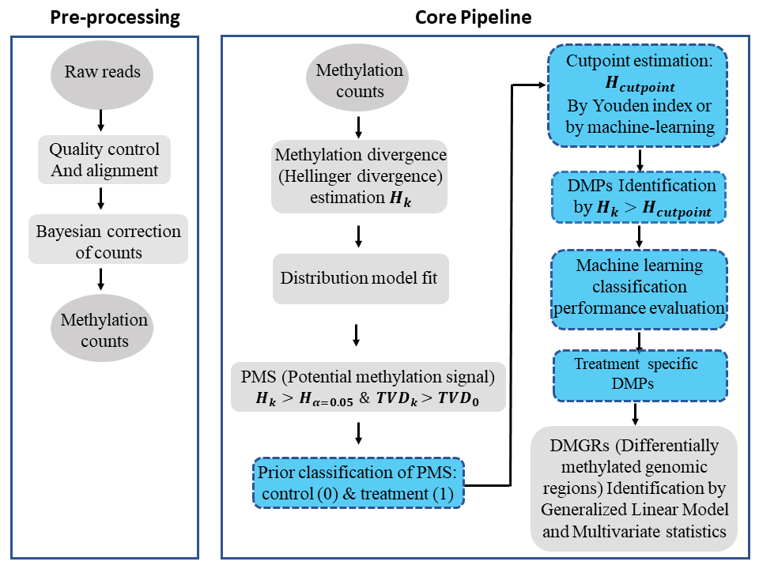

<!-- README.md is generated from README.Rmd. Please edit that file -->
Methyl-IT 
==========================================================

 

Overview
--------

We have developed a novel methylome analysis procedure, Methyl-IT, based on information thermodynamics and signal detection. Methylation analysis involves a signal detection problem, and the method was designed to discriminate methylation regulatory signal from background noise induced by thermal fluctuations. Our group \[[1](#1),[2](#2)\] has proposed an information thermodynamics approach to investigate genome-wide methylation patterning based on the statistical mechanical effect of methylation on DNA molecules. The information thermodynamics-based approach is postulated to provide greater sensitivity for resolving true signal from the thermodynamic background within the methylome \[[1](#1)\]. Because the biological signal created within the dynamic methylome environment characteristic of plants is not free from background noise, the approach, designated Methyl-IT, includes an application of signal detection theory.

A basic requirement for the application of signal detection is the knowledge of the background noise probability distribution. A Weibull probability distribution model can be deduced on a statistical mechanical/thermodynamics basis for DNA methylation induced by thermal fluctuations \[[1](#1)\]. Assuming that this background methylation variation is consistent with a Poisson process, it can be distinguished from variation associated with methylation regulatory machinery, which is non-independent for all genomic regions \[[1](#1)\]. An information-theoretic divergence to express the variation in methylation induced by background thermal fluctuations will follow a Weibull distribution model, provided that it is proportional to minimum energy dissipated per bit of information from methylation change. The information thermodynamics model was previously verified with more than 150 Arabidopsis and more than 90 human methylome datasets \[[3](#3)\].

With Methyl-IT R package we are providing the functions from the R scripts used in the manuscript \[[3](#3)\], as well as, additional functions that will be used in further studies. The application of the information thermodynamics of cytosine DNA methylation is not limited to the current methylome analysis, which is only a particular application. The theory permits us the study of plant and animal methylomes in the framework of a communication system \[[1](#1)\], where cytosine DNA methylation has the dual roles of stabilizing the DNA molecule and to carry the regulatory signals.

Status
------
This application is under development and has not yet been officially released. Watch this repo or check the releases page for the official release. THE PACKAGE IS PROVIDED "AS IS", WITHOUT WARRANTY OF ANY KIND, EXPRESS OR IMPLIED.

Installation
------------

Be sure that both the R and bioconductor packages are up to date. To get the latest version of Bioconductor by starting R and entering the commands:
    
    if (!requireNamespace("BiocManager")) install.packages("BiocManager")
    BiocManager::install()

Install OS packages:

CentOS 7

    sudo yum -y install libcurl-devel.x86_64 openssl-devel.x86_64 libxml2-devel mariadb-devel.x86_64

Ubuntu

    sudo apt install libmysqlclient-dev libcurl4-openssl-dev libssl-dev libxml2-dev git build-essential

Install R dependencies:
    
    install.packages(c("ArgumentCheck", "caret", "Epi", "e1071", "minpack.lm", "nls2", "caTools", "rmarkdown",   "RCurl"),dependencies=TRUE)
    
    BiocManager::install(c('BiocParallel', 'biovizBase', 'DESeq2', 'genefilter', 'GenomeInfoDb', 'GenomicRanges'))

You can install MethylIT from GitHub or PSU's GitLab:

    install.packages("devtools")
    devtools::install_git("https://github.com/genomaths/MethylIT.git")
    
    Or 
    
    devtools::install_git("https://git.psu.edu/genomath/MethylIT.git")
    
       

Flow diagram
------------

Some simple examples
--------

[An example with simulated datasets](https://genomaths.github.io/Methylation_analysis_with_Methyl-IT.html) to illustrate why a signal detection step is needed in methylation analysis.

--------

MethylIT Package Manual:
------------

[https://git.psu.edu/genomath/MethylIT/blob/master/MethylIT-manual.pdf](https://git.psu.edu/genomath/MethylIT/blob/master/MethylIT-manual.pdf)

--------

Scripts and examples at:
------------

https://git.psu.edu/genomath/MethylIT_examples

------------

Data generated or used by MethylIT at:
------------

https://git.psu.edu/genomath/MethylIT_data

------------

References
----------

<a name="1">1</a>. Sanchez R, Mackenzie SA: Information Thermodynamics of Cytosine DNA Methylation. [Plos One 2016, 11](https://doi.org/10.1371/journal.pone.0150427).   <a name="2">2</a>. Sanchez R, Mackenzie SA: Genome-Wide Discriminatory Information Patterns of Cytosine DNA Methylation. [Int. J. Mol. Sci. 2016, 17(6), 938](https://dx.doi.org/10.3390%2Fijms17060938).   <a name="3">3</a>. Sanchez R, Yang X, Kundariya H, Barreras JR, Wamboldt Y, Mackenzie S. Enhancing resolution of natural methylome reprogramming behavior in plants. [BioRxiv](https://doi.org/10.1101/252106).  

License
-------

You are free to copy, distribute and transmit MethylIT for non-commercial purposes. Any use of MethylIT for a commercial purpose is subject to and requires a special license.

Contact
-------

For questions about the MethylIT project, contact <rus547@psu.edu>

Contributor Code of Conduct
---------------------------

Please note that this project is released with a [Contributor Code of Conduct](CONDUCT.md). By participating in this project you agree to abide by its terms.
